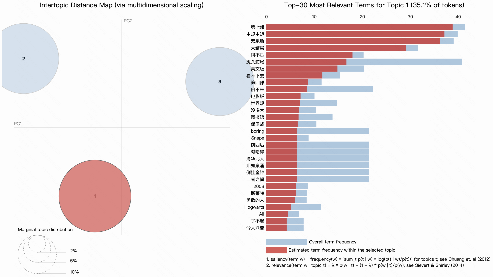
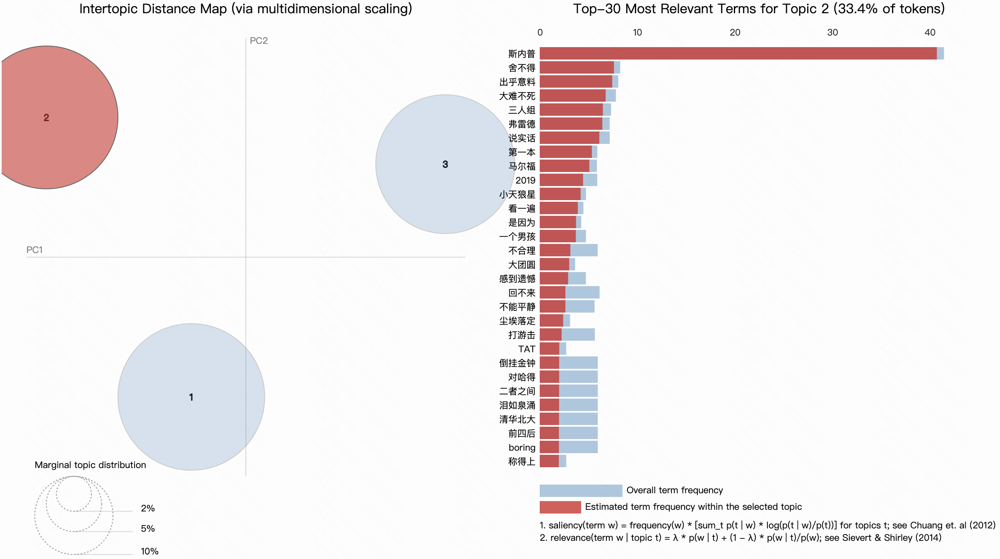
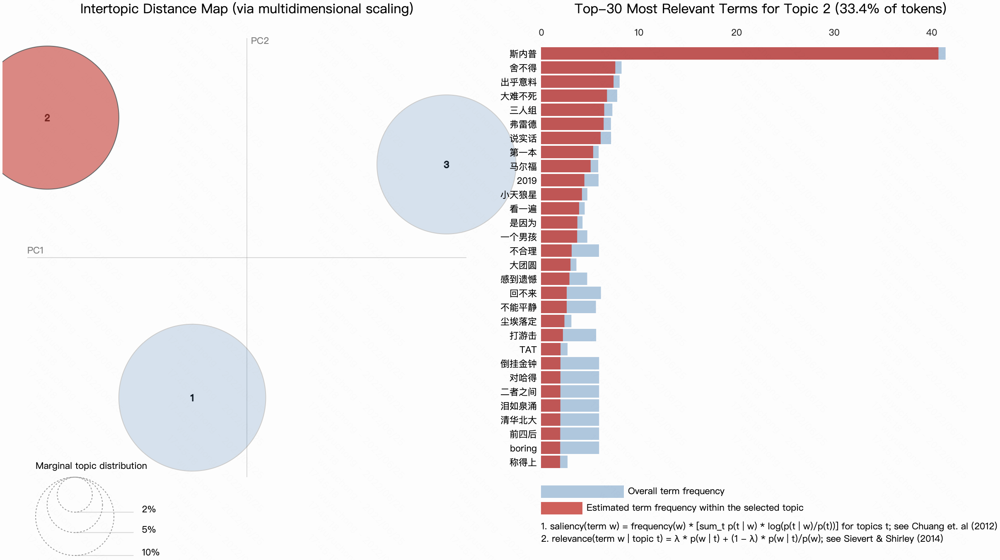
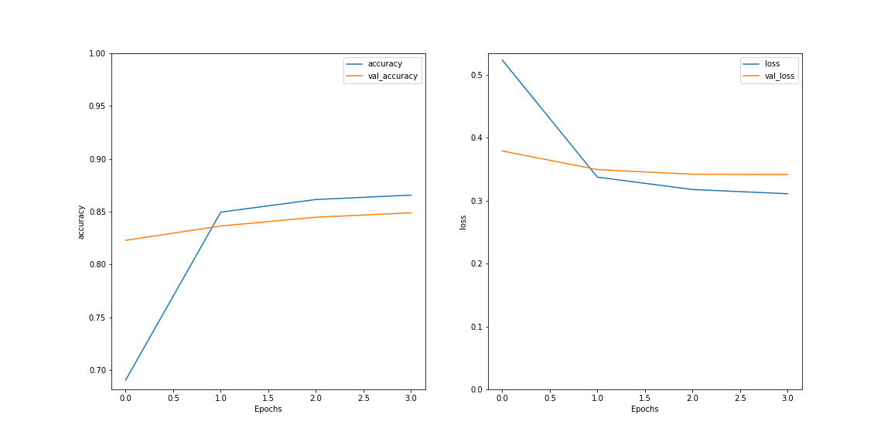
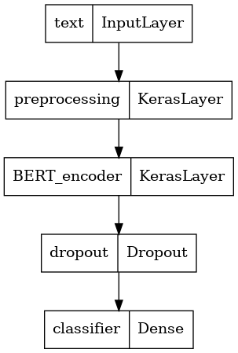
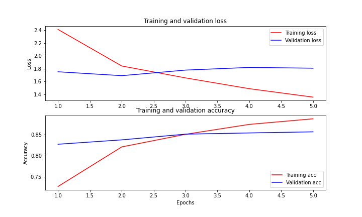
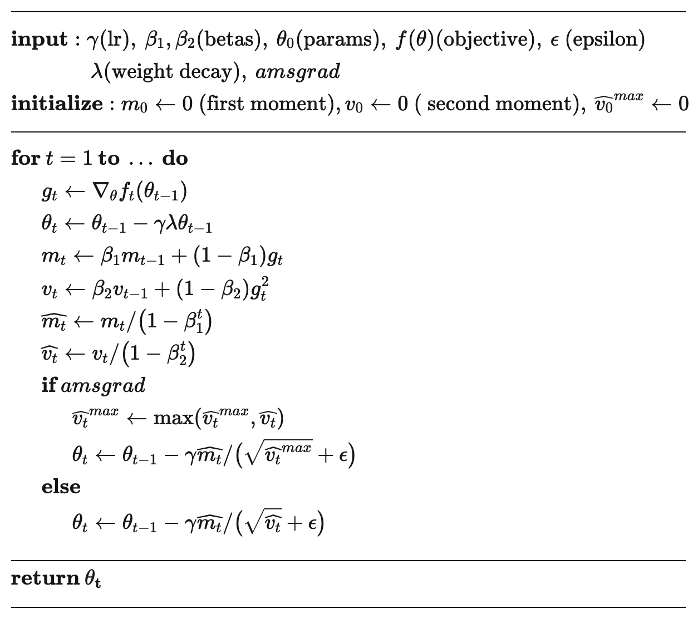

```{r setup, include=FALSE, message=FALSE}
knitr::opts_chunk$set(fig.pos = 'H', echo = FALSE, warning = FALSE, message = FALSE, comment = NA)
library(rmarkdown)
library(knitr)
library(tidyverse)
library(dplyr)
# base_family = 'STXihei'
```

# 摘要{-}

通过网络爬虫的方式获取《哈利波特》全系列图书的评论进行文本分析，我们使用主题模型进行对评论进行文本挖掘，之后进行文本情感分类模型的训练。在文本预处理阶段，我们尝试使用词编码和词向量的方式，在训练阶段，我们构建了 DNN、LSTM、BERT 等多个深度学习模型进行训练，并进行了模型比较，最终达到了 88% 的准确率。最后，为了进一步实现在超大文本集上进行训练，我们使用基于 Spark 的分布式算法在集群服务器上进行训练测试。^[分布式模型在该小型数据集上没有优势，进行此项的意义在于对大型文本数据集可拓展性的技术储备，仅有在文本量级超过单机可承载上限时，分布式计算才具备意义]

| 模型         | 计算配置    | 用时   | 准确率 | 可拓展性 |
| ------------ | ----------- | ------ | ------ | -------- |
| tokenize + DNN   |阿里云服务器 Xeon 8 核 CPU 32G 内存| 3 分钟 | 55% | 低-单机 |
| Word2Vec + LSTM  |阿里云服务器 Xeon 8 核 CPU 32G 内存| 1 小时 | 70% | 低-单机 |
| bert - 小型      |阿里云服务器 Xeon 8 核 CPU 32G 内存| 24分钟 | 78% | 低-单机 |
| bert - AL        |阿里云服务器 Xeon 8 核 CPU 32G 内存| 1.6小时| 82% | 低-单机 |
| bert - 标准      |阿里云服务器 Xeon 8 核 CPU 32G 内存| 1 小时 | 88% | 低-单机 |
| spark - logit    |中央财经大学大数据高性能分布式集群 | 4 分钟 | 73% | 高-集群 |
| spark - 决策树   |中央财经大学大数据高性能分布式集群 | 10 分钟| 80% | 高-集群 |
|spark - 梯度助推树|中央财经大学大数据高性能分布式集群 | 15 分钟| 82% | 高-集群 |
| spark - 随机森林 |中央财经大学大数据高性能分布式集群 | 30 分钟| 87% | 高-集群 |

\newpage

\setcounter{tocdepth}{2}
\tableofcontents

\newpage

# 数据爬取

我们使用 `python` 对豆瓣上 《哈利波特》全系列图书的评论进行爬取。由于豆瓣的评论机制要求读者撰写评论时必须同时填写评价级别，因此我们可以同时获取到评价文本及其对应的情感级别。豆瓣将评价级别分为三类：好、坏、中等，这有利于我们进行通过文本的内容预测评价级别的有监督机器学习训练。

在爬取过程中，我们使用已登录的 cookie 信息和浏览器信息提交请求，并在每两次请求的间隔加入随机时间的休眠，以尽可能地模拟真实人的操作，避免 IP 被官方查封。

|                                 评论|  评分|
|-------------------------------------|------|
|每翻一页便是与你的告别。我不想同你...|  good|
|几年后重新看了最后的几章，在这热得...|  good|
|所有爱唱反调的胖友们，你们都没试过...|  good|
|基本上一如预想。罗琳笔下的主要角色...|  good|
|别的还好，双胞胎死一个活一个实在太...|medium|
|这本稀碎情节太多，完全都是没必要的...|medium|
|               反正总是要看完的嘛！  |medium|
|                 罗琳忽悠了全球读者  |medium|
| 对不起，我实在是无法接受这个结局。  |   bad|
|从哈一到哈七。。。水平依次下降。。...|   bad|

```{r, echo=FALSE, out.width='65%', fig.align='center', fig.cap = "词云图"}

```

\newpage

# 文本预处理

我们使用 jieba 对中文进行分词处理。

1. 去除标签
    * 将一些网页 HTML 特有的标签进行去除，如段落标记、换行标记 `p` `br` 等
1. 去除标点符号
    * 将常用标点符号进行去除，如 `! ;` 等
1. 去除多余的空格
    * 删除无意义的连续性空格
1. 去除数字
    * 由于数字对文本情感识别作用小，我们选择将其删去
1. 去除停用词
    * 对意义较小的常用词进行删除
1. 去除过短的词汇
    * 由于英文中过短的字符一般意义较小，我们选择将其删去
1. 大小写统一
    * 大小写代表同一词汇，需要进行统一
      

Table: 关键词提取

|                            text|rating|     clean_text|label|
|--------------------------------|------|---------------|-----|
| 对不起 ， 我 实在 是 无法 接...|   bad|         对不起|  1.0|
| 从哈一到 哈七 。 。 。 水平 ...|   bad|从哈一到 免不了|  1.0|
|这 套书 根本就是 在 宣扬 扭曲...|   bad|根本就是 价值观|  1.0|
| 翻译 太烂 。 和 上 一本 一样...|   bad|         比不上|  1.0|
|                       糟透了   |   bad|         糟透了|  1.0|

\newpage

# 主题模型

## 主题模型的构建

主题模型是一个相对泛化的概念，从实现了文本数据的结构化的文本模型都能称为主题模型，狭义上一般代指基于隐式Dirichlet先验概率分布模型。

基于主题模型，每一篇文档都是一个主题的多项分布，文档集合事实上可以看作是一个天然的软聚类过程，各个主题就是聚类中心，文档在各个主题上的概率就是它与这个聚类中心的距离。同时，主题模型可以得到各主题下词汇的概率分布，主题-词汇概率矩阵旋转后就可以得到词汇在各个主题的概率分布情况，得到词汇的软聚类结果。

LDA 模型通过将生成的随机文档与真实文档进行相似度对比来决定狄利克雷先验分布的参数，从而得到最优参数的模型。

## 结果分析

我们构建一个 3 个主题的主题模型，并绘制解释图，图中每个气泡代表一个主题，越大的气泡代表该主题涵盖的评论数越多。蓝色柱子代表特定词汇在整个语料库中的词频，红色柱子代表特定词汇在特定话题中的词频。

### 主题一

```{r, echo=FALSE, out.width='99%', fig.align='center', fig.cap = "主题一成分词汇权重图"}

```

第一个话题主要是对大结局的评论。*图书馆保卫战*、*第七部*、*虎头蛇尾*都是对结局的讨论。

### 主题二

```{r, echo=FALSE, out.width='99%', fig.align='center', fig.cap = "主题二成分词汇权重图"}

```

第二个话题主是对书中各类较为主要的人物进行讨论。排名第一的词汇*斯内普*是书中以为颇具争议的反派人物，其性格方面的多重性给了读者非常大的讨论空间，*弗雷德*、*小天狼星*也都是书中较为典型的人物，他们与哈利波特具有密切地联系，

### 主题三

```{r, echo=FALSE, out.width='99%', fig.align='center', fig.cap = "主题三成分词汇权重图"}

```

第三个话题主要围绕最主要人物哈利波特和成长历程中的重要节点剧情进行讨论。*英雄主义*、*火焰杯*、*打游击*都体现了主角的主线剧情。

当然，读者的讨论并非总是局限于同一个话题，在特定的话题下有会参杂着许多对全书的感受、见解看法等等。

\newpage

# 深度学习

## 数据处理

在进行文本情感分类的有监督训练中，我们将评级级别为差和中等的两类合并为消极一类，将好评作为积极一类。

1. 标签处理：分类标签由类别名称转为数字。
1. 数据集划分：在总体 5 万条文本中随机划分 20% 的测试集，再从训练集中划分 20% 的验证集。
    * 使用训练集的文本进行模型训练
    * 使用验证集的文本进行模型超参数的调整
    * 使用测试集的文本进行模型效果评价
1. 数据集格式转换：使用自动的缓冲区大小，使用 32 的 `batch size`。
    * batch size 为一次训练所抓取的数据样本数量
    * 分批训练相对于直接对全训练集训练的好处在于：提高了每次迭代的训练速度、利于多线程训练、使得梯度下降的方向更加准确
    * batch size 的大小与模型的收敛速度和随机梯度噪音有关
    * 当 batch size 过小时，在一定的迭代次数下，模型来不及收敛
    * 当 batch size 过大时，一方面容易出现内存紧缺，另一方面模型的泛化能力会变差

## Tokenize + DNN

### DNN 模型结构

我们搭建了一个三层神经网络用于训练。

```{r}
神经网络层 = c('输入层', 'drop out (50%)', '中间层', 'drop out (50%)', '输出层')
神经元个数 = c(512, 0, 512, 0, 1)
参数个数 = c(512512, 0, 262656, 0, 513)
table = data.frame(神经网络层, 神经元个数, 参数个数)
kable(table, caption = '搭建的神经网络结构（总参数个数：775681）')
```

### 模型训练

正常情况下，随着训练迭代次数的增加，损失函数逐渐减小，对训练集的拟合越来越趋向于精细。然而过度精细的拟合容易导致模型的泛化能力变差，即当模型用于之前未曾训练过的数据时表现很差。为了观测这种情况，我们需要划分一部分数据与用于训练的数据隔开，这便是我们划分验证集的原因之一。

为了防止模型过拟合，我们设定在验证集准确率连续三次迭代不再上升时提前终止训练。

我们让学习率随着迭代次数递减：

$$
\text{learn-rate} = \frac{\text{initial}}{1 + \frac{\text{decay-rate} \times \text{step}}{\text{decay-step}}}
$$

其中：

* decay_rate 为衰减进行的频率：经过多次尝试调参，我们将衰减率定为 $e^{-2}$
* initial 为初始学习率：经过多次尝试调参，我们将初始学习率定为 $e^{-5}$

## Word2Vec + LSTM

### Word2Vec

在词编码的基础上，我们对文本进行 word2vec 处理。Word2Vec 模型将每个单词映射到一个唯一的固定大小向量，同时可用文档中所有单词的平均值将每个文档转换为向量；然后，此向量可用作预测、文档相似度计算等。

### LSTM 模型结构

1. 第一层为 `Embedding` 层，我们使用 `word2vec` 方法将单词编码转换为词向量。这些词向量经过训练，对于意思相近的词，其向量夹角小。
2. 第二层使用双向的长短期记忆层。长短期记忆网络层是一种特殊的循环神经网络层，它能够减轻长序列训练过程中的梯度消失和梯度爆炸问题，适合此处词向量长度较长的情况。它遍历序列中的每个元素作为输入，按照时间顺序传递输出。由于我们使用双向结构，最终结果由输入的前向和后向传递共同决定，这使得最前端的输入不必通过漫长的处理步数才能影响到最终结果，有效的提高了训练在文本中的均匀度。
3. 第三层为全连接层，由于在多层神经网络中梯度容易在深层网络中变得极小，使得参数无法正常更新，所以我们使用 `RELU` 作为激活函数解决梯度消失问题。
4. 第四层为输出维度为 5 的输出层，为了得到多分类的概率值，使用 `softmax` 函数将输出值压缩至 0 - 1 的范围内。

```{r}
神经网络层 = c('Embedding', '双向LSTM', '全连接', '输出层')
神经元个数 = c(64, 128, 64, 1)
参数个数 = c(64000, 66048, 8256, 65)
table = data.frame(神经网络层, 神经元个数, 参数个数)
kable(table, caption = '搭建的神经网络结构（总参数个数：775681）')
```

### 模型训练

```{r, out.width='80%', fig.align='center', fig.cap='LSTM 模型训练过程损失函数和准确率趋势图'}

```

随着迭代次数的上升，模型在训练集和测试集上的损失函数下降，准确率上升。

## BERT

### BERT 介绍

BERT 是一系列双向文字编码转换模型的总称，用来结合上下文语义计算每个词的词向量，在自然语言处理中被广泛使用。

我们使用了前人在超大型语料库上训练的已有基础 BERT 模型，通过迁移学习的方式在我们的 BBC 文本数据集上进行微调。

### 预训练 BERT 模型

我们首先使用了一个参数量较少的 small-BERT 模型用于测试，在通过测试后，为了进一步提升模型的准确度，我们使用 al-BERT 和 标准的 BERT 进行正式训练。

在 BERT 的输入层，对于原始的文字输入，我们需要将其转换成为数值编码。每一个 BERT 模型都有其严格对应的预处理模型来提升转换效果。

对于 small-BERT 模型预处理模型将输入的向量设为 128 的长度。

### BERT 模型结构

```{r, out.width='30%', fig.align='center', fig.cap='BERT 模型结构示意图'}

```

```{r}
神经网络层 = c('Embedding', '双向LSTM', '全连接', '输出层')
神经元个数 = c(64, 128, 64, 1)
参数个数 = c(64000, 66048, 8256, 65)
table = data.frame(神经网络层, 神经元个数, 参数个数)
kable(table, caption = '搭建的神经网络结构（总参数个数：775681）')
```

### 模型训练

```{r, out.width='80%', fig.align='center', fig.cap='BERT 模型训练过程损失函数和准确率趋势图'}

```

随着迭代次数的上升，模型在训练集损失函数下降，但在验证集上损失函数基本保持平稳，准确率上升。

我们使用交叉熵作为我们的损失函数：

$$ -\sum_{c=1}^My_{o,c}\log(p_{o,c}) $$

其中：

- M 是分类数
- y 是标签 c 在观测 o 下是否分类正确的 0/1 变量
- p 是预测概率

由于神经网络刚开始训练时非常不稳定，因此刚开始的学习率应当设置得很低很低，这样可以保证网络能够具有良好的收敛性。但是较低的学习率会使得训练过程变得非常缓慢，因此这里采用从较低学习率逐渐增大至较高学习率的方式实现网络训练前 10% 次迭代的“热身”阶段。一直使用较高学习率是不合适的，因为它会使得权重的梯度一直来回震荡，很难使训练的损失值达到全局最低谷。因此在 warm-up 结束后，我们使用线性减小的学习率。

在迁移学习时，我们选取的优化器与 BERT 在预训练时的 `Adamw` 优化器保持一致。

```{r, out.width='50%', fig.align='center', fig.cap='Adamw 算法示意图'}

```

Adam 的超收敛性质使其在训练学习率高的神经网络时可以达到节省迭代次数的效果。只要调整得当，Adam 在实践上都能达到 SGD+Momentum 的高准确率，而且速度更快。在几年前人们普遍认为 Adam 的泛化性能不如 SGD-Momentum，然而今年论文表明这通常是由于所选择的超参数不正确导致，通常来说 Adam 需要的正则化比 SGD 更多。

### 模型评价

我们在测试集上进行拟合，得到准确率为 78%。由于该模型仅仅为小型的 BERT，为了进一步提升模型的准确度，我们使用 al-BERT 和 标准的 BERT 进行正式训练，分别达到了 82% 和 88% 的准确率。

### 模型应用

使用模型对输入的文本进行分类。我们输入一则测试新闻文本：“这部书很差劲”，该文本被模型分类为消极，符合预期。

# 分布式训练

我们使用 `pyspark` 进行分布式训练。分布式不同于单机训练，而是通过集群上许多的计算机节点同时进行训练。对于文本量很大的数据集而言，单机可能不具备足够的内存和 CPU 资源进行训练，借助于分布式系统，我们能调度集群计算资源进行计算。`pyspark` 是 `spark` 在 `python` 下的实现，它使用 Zookeeper、hadoop 作为底层，通过 MapReduce 的方式将大的计算任务拆解成为一个个小的任务，分发到每个计算机节点上进行计算。

## 环境启动

* 通过 YARN 资源调度系统提交到作业队列： `spark-submit --master yarn`
* 由于在 UDF（用户自定义）函数中使用了第三方包，需要将其发送至集群中的每个计算节点 `--py-files gensim.zip`
* 队列计算完成后将结果重定向输出 `> output.txt`

## 数据读取

由于数据为逗号分隔的 csv 格式，在文本列出现混淆。我们使用 pandas 进行读取后再转换为 spark DataFrame 格式

## 文本特征工程

词频-逆文档频率（TF-IDF）是一种广泛用于文本挖掘的特征向量化方法，它反映了单个词汇相对于语料库中文档的重要性。我们用表示 $t$ 代表词汇，用 $d$ 代表 表示文档，用 $D$ 表示语料库。词频 $TF(t, d)$ 是该词在文档 $d$ 中出现的次数，而文档频率 $DF(t, D)$ 是包含该词的文档的数量。如果我们只使用词频来衡量重要性，很容易过分强调那些出现频率很高但几乎没有关于文档的信息的词，例如“这”“的”等词汇。如果一个术语在语料库中经常出现，则意味着它不包含有关特定文档的特殊信息。逆文档频率是一个术语提供多少信息的数值度量：

$$I D F(t, D)=\log \frac{|D|+1}{D F(t, D)+1}$$

其中 $|D|$ 是语料库中的文档总数。

由于使用对数，如果一个词出现在所有文档中，它的 IDF 值变为 0，因此使用平滑词以避免对语料库之外的词除以零。TF-IDF 是 TF 和 IDF 的乘积：

$$T F I D F(t, d, D)=T F(t, d) \cdot I D F(t, D)$$

在 TF 的基础上，我们使用改进版的 HashingTF 进行处理。HashingTF 将词汇转换为固定长度的特征向量。HashingTF 利用散列表应用哈希函数映射词汇到索引，之后通过映射的函数计算词频，能有效降低 TF 在大型语料库所需的时间。

我们从一组句子开始，将每个句子分成单词，构建词袋，使用 HashingTF 将句子散列成特征向量，使用 IDF 重新缩放特征向量，然后将我们的特征向量传递给学习算法。


## 训练模型

我们首先使用简单的 logistic 模型进行拟合，在训练集上进行拟合，之后在测试集上验证模型的效果。

Table: 真是值与预测值示例

|真实值|预测值|
|-----|----------|
|  0.0|       0.0|
|  0.0|       0.0|
|  1.0|       1.0|
|  1.0|       1.0|
|  0.0|       0.0|
|  1.0|       1.0|
|  0.0|       1.0|
|  0.0|       0.0|

我们准备了两个测试用例来验证模型是否有效。

1. 我喜欢这部书
2. 它很差劲

模型对前一个句子的分类结果为积极，对一个句子的分类结果为消极。

## 模型比较

在 logistic 模型的基础上，我们还搭建了决策树模型、梯度助推树模型、随机森林模型。

决策树的特点是它总是在沿着特征做切分。随着层层递进，这个划分会越来越细。

梯度助推树模型使用 Boosting 的方式把基础模型组合起来。既然决策树基础模型可以做出不完美的预测，那么用第二的基础模型，把“不完美的部分”补上，不断地对“不完美的部分”进行完善，就可以得到效果足够好的集成模型。Boosting的策略非常多，以GBDT为例，它会用第K个CART拟合前k-1个CART留下的残差，从而不断的缩小整个模型的误差。

相比于决策树模型，随机森林其实是一种集成算法。它首先随机选取不同的特征(feature)和训练样本(training sample)，生成大量的决策树，然后综合这些决策树的结果来进行最终的分类。所以理论上随机森林相比单一的决策树模型一般来说准确性上有很大的提升，同时一定程度上改善了决策树容易被攻击的特点。

## 模型调参

我们使用网格搜索的方式对几个模型的超参数进行调整，选取最优的模型。

\newpage

# 结论

在本研究中，我们通过网络爬虫的方式获取《哈利波特》全系列图书的评论进行文本分析，在文本预处理阶段，我们首先进行文本清洗，之后对中文文本进行分词，再进行文本特征工程。

## 主题模型

使用主题模型，我们对评论进行主题提取，提取出三个最主要的主题：

1. 第一个话题主要是对大结局的评论。*图书馆保卫战*、*第七部*、*虎头蛇尾*都是对结局的讨论。
2. 第二个话题主是对书中各类较为主要的人物进行讨论。排名第一的词汇*斯内普*是书中以为颇具争议的反派人物，其性格方面的多重性给了读者非常大的讨论空间，*弗雷德*、*小天狼星*也都是书中较为典型的人物，他们与哈利波特具有密切地联系，
3.  第三个话题主要围绕最主要人物哈利波特和成长历程中的重要节点剧情进行讨论。*英雄主义*、*火焰杯*、*打游击*都体现了主角的主线剧情。

## 评价分类训练

我们使用用户的评论评价进行文本情感分类模型的训练。在文本预处理阶段，我们尝试使用词编码和词向量的方式，在训练阶段，我们构建了 DNN、LSTM、BERT 等多个深度学习模型进行训练，并进行了模型比较，最终达到了 88% 的准确率。最后，为了进一步实现在超大文本集上进行训练，我们使用基于 Spark 的分布式算法在集群服务器上进行训练测试。^[分布式模型在该小型数据集上没有优势，进行此项的意义在于对大型文本数据集可拓展性的技术储备，仅有在文本量级超过单机可承载上限时，分布式计算才具备意义]

| 模型         | 计算配置    | 用时   | 准确率 | 可拓展性 |
| ------------ | ----------- | ------ | ------ | -------- |
| tokenize + DNN   |阿里云服务器 Xeon 8 核 CPU 32G 内存| 3 分钟 | 55% | 低-单机 |
| Word2Vec + LSTM  |阿里云服务器 Xeon 8 核 CPU 32G 内存| 1 小时 | 70% | 低-单机 |
| bert - 小型      |阿里云服务器 Xeon 8 核 CPU 32G 内存| 24分钟 | 78% | 低-单机 |
| bert - AL        |阿里云服务器 Xeon 8 核 CPU 32G 内存| 1.6小时| 82% | 低-单机 |
| bert - 标准      |阿里云服务器 Xeon 8 核 CPU 32G 内存| 1 小时 | 88% | 低-单机 |
| spark - logit    |中央财经大学大数据高性能分布式集群 | 4 分钟 | 73% | 高-集群 |
| spark - 决策树   |中央财经大学大数据高性能分布式集群 | 10 分钟| 80% | 高-集群 |
|spark - 梯度助推树|中央财经大学大数据高性能分布式集群 | 15 分钟| 82% | 高-集群 |
| spark - 随机森林 |中央财经大学大数据高性能分布式集群 | 30 分钟| 87% | 高-集群 |

\newpage

# 参考文献

[1]张征杰,王自强.文本分类及算法综述[J].电脑知识与技术,2012,8(04):825-828+841.

[2]汪岿,刘柏嵩.文本分类研究综述[J].数据通信,2019(03):37-47.

[3]贾澎涛,孙炜.基于深度学习的文本分类综述[J].计算机与现代化,2021(07):29-37.

[4]王博,刘盛博,丁堃,刘则渊.基于LDA主题模型的专利内容分析方法[J].科研管理,2015,36(03):111-117.DOI:10.19571/j.cnki.1000-2995.2015.03.014.

[5]关鹏,王曰芬,傅柱.不同语料下基于LDA主题模型的科学文献主题抽取效果分析[J].图书情报工作,2016,60(02):112-121.DOI:10.13266/j.issn.0252-3116.2016.02.018.

[6]黄佳佳,李鹏伟,彭敏,谢倩倩,徐超.基于深度学习的主题模型研究[J].计算机学报,2020,43(05):827-855.

[7]胡吉明,陈果.基于动态LDA主题模型的内容主题挖掘与演化[J].图书情报工作,2014,58(02):138-142.DOI:10.13266/j.issn.0252-3116.2014.02.023.

[8]陈晓美,高铖,关心惠.网络舆情观点提取的LDA主题模型方法[J].图书情报工作,2015,59(21):21-26.DOI:10.13266/j.issn.0252-3116.2015.21.003.

\newpage

# 爬取文本展示

```{r, highlight=FALSE, eval=FALSE, echo=TRUE, code=xfun::read_utf8('../text/show.txt')}
```
