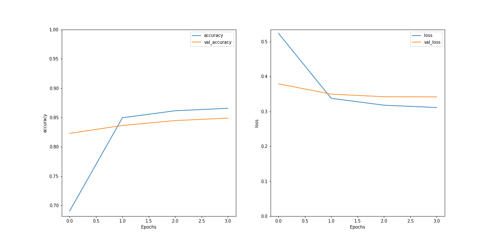

```{r setup, include=FALSE, message=FALSE}
knitr::opts_chunk$set(fig.pos = 'H', echo = FALSE, warning = FALSE, message = FALSE, comment = NA)
library(rmarkdown)
library(knitr)
library(tidyverse)
library(dplyr)
library(readxl)
# base_family = 'STXihei'
```

# 摘要

我们使用主题模型进行对电影评论进行文本挖掘，之后进行情感分类模型的训练。在文本预处理阶段，我们尝试使用词编码和词向量的方式，在训练阶段，我们构建了 DNN、LSTM、BERT 等多个深度学习模型进行训练，并进行了模型比较，最终达到了 90% 的准确率。最后，为了进一步实现在超大文本集上进行训练，我们使用基于 Spark 的分布式算法在集群服务器上进行训练测试。^[分布式模型在该小型数据集上没有优势，进行此项的意义在于对大型文本数据集可拓展性的技术储备，仅有在文本量级超过单机可承载上限时，分布式计算才具备意义]

| 模型         | 计算配置    | 用时   | 准确率 | 可拓展性 |
| ------------ | ----------- | ------ | ------ | -------- |
| tokenize + DNN   |阿里云服务器 Xeon 8 核 CPU 32G 内存| 10 分钟 | 60% | 低-单机 |
| Word2Vec + LSTM  |阿里云服务器 Xeon 8 核 CPU 32G 内存| 2  小时 | 80% | 低-单机 |
| bert - 小型      |阿里云服务器 Xeon 8 核 CPU 32G 内存| 1  小时 | 86% | 低-单机 |
| bert - AL        |阿里云服务器 Xeon 8 核 CPU 32G 内存| 1.5小时 | 88% | 低-单机 |
| bert - 标准      |阿里云服务器 Xeon 8 核 CPU 32G 内存| 3  小时 | 90% | 低-单机 |
| spark - logit    |中央财经大学大数据高性能分布式集群 | 10 分钟 | 83% | 高-集群 |
| spark - 决策树   |中央财经大学大数据高性能分布式集群 | 40 分钟 | 85% | 高-集群 |
|spark - 梯度助推树|中央财经大学大数据高性能分布式集群 | 20 分钟 | 87% | 高-集群 |
| spark - 随机森林 |中央财经大学大数据高性能分布式集群 | 1.5小时 | 89% | 高-集群 |

\newpage

\setcounter{tocdepth}{2}
\tableofcontents

\newpage

# 数据集介绍

我们选择了 IMDB 的电影评论文本数据进行大数据建模研究。

IMDB 是一个隶属于亚马逊公司旗下的世界著名互联网电影资料库（Internet Movie Database）。它有着关于电影演员、电影、电视节目、电视明星和电影制作的在线数据，包括了影片的众多信息、演员、片长、内容介绍、分级、评论等，在电影评论评分时被广泛使用。IMDB 的论坛也十分活跃，除每个数据库条目都有留言板之外，还有关于多种多样的主题的各种综合讨论版。

我们将 IMDB 的电影评论文本用于自然语言处理的二元情感分类。我们使用 5 万条标有积极和消极标签的真实用户电影评论文本构建情感分类模型。 即使用深度学习算法预测评论为正面或是负面。

我们使用的文本为多语言文本，其中英文文本数量占绝大多数比例。

|              评论|情感|
|--------------------|---------|
|One of the other ...| positive|
|A wonderful littl...| positive|
|I thought this wa...| positive|
|Basically there's...| negative|
|Petter Mattei's "...| positive|
|Probably my all-t...| positive|
|I sure would like...| positive|

# 方法综述

## 主题模型

王博等人使用LDA主题模型应用于专利内容分析领域，划分不同专利的主题，并在原有模型上建立LDA机构-主题模型，将专利的主体和客体相结合联合建模，实现内在关系分析。（王博等，2015）关鹏等使用LDA主题模型从定性和定量两个方面对于关键词、摘要以及关键词和摘要共同构建文本语料库的不同方式进行评价。（关鹏等，2016）黄佳佳等对主题模型进行了系统性研究，分析归纳总结了传统主题模型各类型的联系区别和优势，并综述了基于深度学习的主题模型研究，分析并展望了其未来发展趋势。（黄佳佳等，2019）胡吉明等将增量Gibbs抽样估计算法引入LDA主题模型，进行了动态化改进，将主题的内容和强度进行了分析，将文本时间信息纳入模型。（胡吉明等，2014）陈晓美等在网络舆论使用LDA主题模型提取舆情观点，从海量舆论评论中摘取深度评论的主要观点，拓展用户认知深度和广度（陈晓美等，2015）

## 文本预处理

### 分词

分词是NLP（自然语言处理）中的一个重要基础步骤，就是将原始数据中的文章、段落、句子这样的长文本的集合，拆分成以单词作为单位的数据，这样有利于后续的处理工作。NLP同其他机器学习算法一样，通过将不同类型的问题转化成数学问题，来解决众多复杂课题。文本作为非结构化数据，经一定步骤转化为结构化数据，就可以进一步转化为数学问题，从而进行分类、预测、LDA主题模型等处理，而分词就是转化的最初一步，也是重要步骤。另一方面，单词是比较适合于研究的粒度。字或字母的粒度太小，无法传递清晰完整的含义，中文中的字可能有多种含义，而英文中的字母则通常没有具体意义；而句子或段落的粒度过大，包含的信息量大，很难通过算法进行提炼并重复使用。因此，单词作为能够传递完整语义的最小构成单位，自然成为了NLP中使用的粒度。

英文分词与中文相比，英文有空格作为天然的分隔符，因此切分起来相对容易。但另一方面，英文中的单词拥有复杂多变的变换形式，如动词存在时态变化、名词存在单复数不同形式等，若不进行还原提取的话，就会增加数据的稀疏性，不利于后续的建模分析。

### 文本清洗

由于实际操作中使用的原始数据通常并不是完美的格式，如：爬虫获取的数据时常存在html标签，句子或段落中存在的换行符、制表符等非空格空白符，都会对分词造成干扰，增加没有实际意义的单词，影响后续的数据分析，分词前的文本清洗就显得十分有必要。本文使用的数据为爬虫得到的影评，因此分词前文本清洗步骤主要为使用正则表达式re库，去除html标签、去除被和谐词，及常见的去除单引号、去除非空格空白符等。

文本中存在的人称代词、常见动词、名词等出现频率很高，但并不能反映句子或段落的主要含义，这些单词被归为停用词，在文本中被视为噪音。对于分词后的数据，为不影响后续的分析结果，应该将停用词予以删除。本文使用了NLTK的语料库中的英文停用词列表，并相应增加了一些自定义的单词来进行停用词处理。

### 词形还原

词干提取（Stemming）与词形还原（Lemmatisation）是英文语料预处理过程中分词后的重要环节，他们的目的都是将具有不同派生形态的单词简化或归并为词干或原形，对词的不同形态进行统一归并，从而降低数据的稀疏性及规模，方便后续的处理与分析。二者也存在不同点：

词干提取基于的原理是“缩减“，去除单词的前后缀（名词复数、过去分词、进行式等）得到词根，如plays、played、playing经提取后都得到play。相较而言，词干提取相对简单，但提取得到的结果可能只是词的一部分，并非完整的、有意义的单词。目前有三种常见的词干提取算法： （1）Porter：该算法开始于20世纪80年代，目前已经停止开发。重点放在删除单词的共同结尾，方便解析为通用形式。通常情况下，在研究中它可以作为一种很好的基本词干算法，作为起始的词干分析器，能够保证重复性，同时相较其他算法也比较温和，但并不太适合进行复杂的应用；（2）Snowball：也被成为Porter2算法，在Porter2的基础上进行了许多优化，分词结果差异约在5%左右；（3）Lancaster：该算法比较激进，有时候会把单词处理成一些比较怪异的形式。如果是在NLTK中进行分词，则可以非常轻松地往该算法中添加自定义规则。

而词形还原则的原理则是“转变“，基于字典将单词的复杂形式转变为其原形，如drove、driving都将被处理成drive。因此，词形还原更为复杂，不仅需要转化词缀，还需要区分原形不同但具有相同词性的单词（如leaves可能为动词leave的第三人称形式，也可能为名词leaf的复数形式），根据上下文进行词性识别。与词干提取相比，词形还原后的单词完整、具有一定意义，更具有研究与应用的价值。

本文使用gensim库的models包中的Phrases与phrases.Phraser模块训练bigram与trigram模型，通过前后单词辅助词性识别；使用spacy库中的英文字典进行词形还原。

## 分类算法

在本研究中，我们使用了一些业界常见的算法进行分类。

（1）	朴素贝叶斯

该算法是一种典型的概率模型算法，通过数据与先验概率决定后验概率。优点是原理简单、分类的性能稳定，待估参数的数量少，对缺失值不敏感，适合进行增量式训练。不足之处在于容易因为先验模型假设的问题，造成预测效果不好，同时当属性之间关联性较强，或者数量较多时，分类结果较差。

（2）	K最近邻（KNN）

主要原理是待分类样本的类别，由特征空间中离它最近的样本类别来决定。该算法可以适用于样本量较大的文本数据集，其优势在于训练的代价较低，对类域交叉或重叠较多的样本比较容易处理。其缺点是它的时空复杂度较大，当数据集存在偏斜，或样本量较小时容易产生误分类，同时初始k值的选择会影响分类效果。

（3）	支持向量机（SVM）

本算法通过学习来寻找间隔最大的超平面，来对样本数据进行分割。在处理高维稀疏、小样本数据时有优势，并且可以解决非线性问题。但它的训练速度比较慢，对数据缺失很敏感，同时核函数的选择缺少统一的标准。

（4）	决策树

主要原理是在已知各种情况发生的概率的基础上，将数据所有特征的判断级连起来，通过一系列判断规则来对样本进行分类。优点是易于理解与解释，计算复杂度不高。但当数据量超过一定程度时，规则库会过大，容易因数据敏感性增强产生过拟合。与其他文本分类算法相比性能较弱。

（5）	Rocchio算法

该算法使用训练语料来为每个类别构造一个质心向量，通过计算待分类文档与质心向量的相似性来划分类别，相似性的度量通常采用夹角余弦、向量内积、欧式距离等。它的算法简单，易于实现与理解，训练与分类的效率很高。但容易受样本分布影响，且构造的质心向量可能会落在所属的类别之外。

（6）	深度学习分类算法

与以上传统的文本分类算法相比，深度学习作为机器学习的重要分支，可以通过多层语义操作，得到更加抽象、层级更多的语义特征。它的优势还包括能够在模型的建立过程中融入特征提取工作，使得人为设计特征导致的不完备性与冗余得到减少。常用于文本分类的深度学习算法主要有：卷积神经网络（CNN）、循环神经网络（RNN）、注意力机制（Attention Mechanism）等及以上算法的一些结合。


# 主题挖掘

我们进行主题模型的构建以及实现可视化。在模型构建之前需要对数据集进行处理，包括提取评论后去除换行符，单引号等，将得到的单词转换为列表储存。接下来将数据集使用Bigram，Trigram训练模型进行词形还原得到新的数据集。使用gensim库提供的函数直接提取成一部无重复单词的字典，接着统计训练语料的词频，运用LDA模型进行训练得到四个主题下词语的分布概率。接下来计算主导主题在每个文档中的贡献占比，通过计算找出每个主题最有代表性的句子。并将每个主题前十个关键词和主题关键词的单词数分别通过云图和统计表的形式展现出来。

主题模型能够自动将文本语料库编码成一组具有实质性意义的类别，这些类别称之为主题。主题模型分析的典型代表是隐含迪利克雷分布也就是LDA，LDA最明显的特征是能够将若干文档自动编码分类为一定数量的主题，极大减少了认为干预及负担。主题数量需要人为指定，在这里我们将主题数量定为4，该模型可以得到每个主题下词语的分布概率。LDA的工作原理是设定α和β两个参数决定模型的工作状态，得到一篇随机生成的文档，通过对比这篇文档与原文档的相似性可以判断该参数下模型的好坏，在不同参数的很多模型中，最终找到最优的模型，即找到最佳的α与β的值。α和β分别控制一个迪利克雷分布，α随机生成文档对应主题的多项式分布θ，θ随机生成一个主题z，而β随机生成主题对应词语的多项式分布φ，综合主题z和主义对应词语分布情况φ生成词语w，如此循环生成一个文档，包含m个词语，最终生成k个主题下的n篇文档。

将预处理后的数据集放入一个二维列表，将列表里的单词去掉停止词后，使用gensim库提供的函数直接提取成一部无重复单词的字典，接着统计训练语料的词频，运用LDA模型进行训练，得到四个主题下词语的分布概率。参数corpus用于确定语料库；参数id2word用于确定词汇表大小，以及调试和主题打印；参数passes确定训练期间通过语料库的次数；参数num_topics确定主题的数量；参数update_every 确定每次更新要迭代的文档数，在此迭代学习设置为1。

文字云是关键词的视觉化描述，把需要的关键词绘制成图片，通过改变字体大小或颜色来表现其重要程度。这里在每个主题下展示了十个词频最高的单词，其频率大小以字体大小来体现。参数max_words指定词云中能显示的最多单词数；参数stop_words指定在词云中不显示的单词列表；background_color指定词云图片的背景颜色。

```{r}
table = read_excel("../output/LDA.xlsx", sheet = 1)
names(table) = c('主题', '贡献率', '关键词', '代表词')
kable(table[, c(1,2,3)])
kable(table[, c(1,2,4)])
```

该表将四个主题的影响力通过百分比的形式直观地展现出来，并给出了对应文本和文本关键词，第三个主题贡献率最高，达到了99.10%。

```{r, out.width='50%', fig.align='center', fig.cap='LDA模型图'}
knitr::include_graphics("../figure/LDA.png")
```

第一个主题影响力最大的为murder和suspect偏向于电影类型，主题二则是back，leave等单词，主题三词频差距比较明显，film和movie占主导地位，最后一个主题的分布比较平均，各单词影响力相当。

```{r, out.width='99%', fig.align='center', fig.cap='主题词频统计'}
knitr::include_graphics("../figure/bar_plot.png")
```

# 深度学习

## 数据处理

1. 标签处理：分类标签由类别名称转为数字。
1. 数据集划分：在总体 5 万条文本中随机划分 20% 的测试集，再从训练集中划分 20% 的验证集。
    * 使用训练集的文本进行模型训练
    * 使用验证集的文本进行模型超参数的调整
    * 使用测试集的文本进行模型效果评价
1. 数据集格式转换：使用自动的缓冲区大小，使用 32 的 `batch size`。
    * batch size 为一次训练所抓取的数据样本数量
    * 分批训练相对于直接对全训练集训练的好处在于：提高了每次迭代的训练速度、利于多线程训练、使得梯度下降的方向更加准确
    * batch size 的大小与模型的收敛速度和随机梯度噪音有关
    * 当 batch size 过小时，在一定的迭代次数下，模型来不及收敛
    * 当 batch size 过大时，一方面容易出现内存紧缺，另一方面模型的泛化能力会变差

## Tokenize + DNN

### DNN 模型结构

我们搭建了一个三层神经网络用于训练。

```{r}
神经网络层 = c('输入层', 'drop out (50%)', '中间层', 'drop out (50%)', '输出层')
神经元个数 = c(512, 0, 512, 0, 1)
参数个数 = c(512512, 0, 262656, 0, 513)
table = data.frame(神经网络层, 神经元个数, 参数个数)
kable(table, caption = '搭建的神经网络结构（总参数个数：775681）')
```

### 模型训练

正常情况下，随着训练迭代次数的增加，损失函数逐渐减小，对训练集的拟合越来越趋向于精细。然而过度精细的拟合容易导致模型的泛化能力变差，即当模型用于之前未曾训练过的数据时表现很差。为了观测这种情况，我们需要划分一部分数据与用于训练的数据隔开，这便是我们划分验证集的原因之一。

为了防止模型过拟合，我们设定在验证集准确率连续三次迭代不再上升时提前终止训练。

我们让学习率随着迭代次数递减：

$$
\text{learn-rate} = \frac{\text{initial}}{1 + \frac{\text{decay-rate} \times \text{step}}{\text{decay-step}}}
$$

其中：

* decay_rate 为衰减进行的频率：经过多次尝试调参，我们将衰减率定为 $e^{-2}$
* initial 为初始学习率：经过多次尝试调参，我们将初始学习率定为 $e^{-5}$

## Word2Vec + LSTM

### Word2Vec

在词编码的基础上，我们对文本进行 word2vec 处理。Word2Vec 模型将每个单词映射到一个唯一的固定大小向量，同时可用文档中所有单词的平均值将每个文档转换为向量；然后，此向量可用作预测、文档相似度计算等。

### LSTM 模型结构

1. 第一层为 `Embedding` 层，我们使用 `word2vec` 方法将单词编码转换为词向量。这些词向量经过训练，对于意思相近的词，其向量夹角小。
2. 第二层使用双向的长短期记忆层。长短期记忆网络层是一种特殊的循环神经网络层，它能够减轻长序列训练过程中的梯度消失和梯度爆炸问题，适合此处词向量长度较长的情况。它遍历序列中的每个元素作为输入，按照时间顺序传递输出。由于我们使用双向结构，最终结果由输入的前向和后向传递共同决定，这使得最前端的输入不必通过漫长的处理步数才能影响到最终结果，有效的提高了训练在文本中的均匀度。
3. 第三层为全连接层，由于在多层神经网络中梯度容易在深层网络中变得极小，使得参数无法正常更新，所以我们使用 `RELU` 作为激活函数解决梯度消失问题。
4. 第四层为输出维度为 5 的输出层，为了得到多分类的概率值，使用 `softmax` 函数将输出值压缩至 0 - 1 的范围内。

```{r}
神经网络层 = c('Embedding', '双向LSTM', '全连接', '输出层')
神经元个数 = c(64, 128, 64, 1)
参数个数 = c(64000, 66048, 8256, 65)
table = data.frame(神经网络层, 神经元个数, 参数个数)
kable(table, caption = '搭建的神经网络结构（总参数个数：775681）')
```

### 模型训练

```{r, out.width='80%', fig.align='center', fig.cap='LSTM 模型训练过程损失函数和准确率趋势图'}

```

随着迭代次数的上升，模型在训练集和测试集上的损失函数下降，准确率上升。

## BERT

### BERT 介绍

BERT 是一系列双向文字编码转换模型的总称，用来结合上下文语义计算每个词的词向量，在自然语言处理中被广泛使用。

我们使用了前人在超大型语料库上训练的已有基础 BERT 模型，通过迁移学习的方式在我们的 BBC 文本数据集上进行微调。

### 加载预训练 BERT 模型

我们首先使用了一个参数量较少的 small-BERT 模型用于测试，在通过测试后，为了进一步提升模型的准确度，我们使用 al-BERT 和 标准的 BERT 进行正式训练。

### 预处理模型

在 BERT 的输入层，对于原始的文字输入，我们需要将其转换成为数值编码。每一个 BERT 模型都有其严格对应的预处理模型来提升转换效果。

对于 small-BERT 模型预处理模型将输入的向量设为 128 的长度。

### BERT 模型结构

```{r, out.width='30%', fig.align='center', fig.cap='BERT 模型结构示意图'}
knitr::include_graphics("../figure/bert_model.png")
```

```{r}
神经网络层 = c('Embedding', '双向LSTM', '全连接', '输出层')
神经元个数 = c(64, 128, 64, 1)
参数个数 = c(64000, 66048, 8256, 65)
table = data.frame(神经网络层, 神经元个数, 参数个数)
kable(table, caption = '搭建的神经网络结构（总参数个数：775681）')
```

### 模型训练

```{r, out.width='80%', fig.align='center', fig.cap='BERT 模型训练过程损失函数和准确率趋势图'}
knitr::include_graphics("../figure/bert_train.png")
```

随着迭代次数的上升，模型在训练集损失函数下降，但在验证集上损失函数基本保持平稳，准确率上升。

#### 损失函数

我们使用交叉熵作为我们的损失函数：

$$ -\sum_{c=1}^My_{o,c}\log(p_{o,c}) $$

其中：

- M 是分类数
- y 是标签 c 在观测 o 下是否分类正确的 0/1 变量
- p 是预测概率

#### 学习率

由于神经网络刚开始训练时非常不稳定，因此刚开始的学习率应当设置得很低很低，这样可以保证网络能够具有良好的收敛性。但是较低的学习率会使得训练过程变得非常缓慢，因此这里采用从较低学习率逐渐增大至较高学习率的方式实现网络训练前 10% 次迭代的“热身”阶段。一直使用较高学习率是不合适的，因为它会使得权重的梯度一直来回震荡，很难使训练的损失值达到全局最低谷。因此在 warm-up 结束后，我们使用线性减小的学习率。

#### 优化器

在迁移学习时，我们选取的优化器与 BERT 在预训练时的 `Adamw` 优化器保持一致。

```{r, out.width='50%', fig.align='center', fig.cap='Adamw 算法示意图'}
knitr::include_graphics("../figure/Adamw.png")
```

Adam 的超收敛性质使其在训练学习率高的神经网络时可以达到节省迭代次数的效果。只要调整得当，Adam 在实践上都能达到 SGD+Momentum 的高准确率，而且速度更快。在几年前人们普遍认为 Adam 的泛化性能不如 SGD-Momentum，然而今年论文表明这通常是由于所选择的超参数不正确导致，通常来说 Adam 需要的正则化比 SGD 更多。

### 模型评价

我们在测试集上进行拟合，得到准确率为 86%。由于该模型仅仅为小型的 BERT，为了进一步提升模型的准确度，我们使用 al-BERT 和 标准的 BERT 进行正式训练，分别达到了 88% 和 90% 的准确率。

### 模型应用

使用模型对输入的文本进行分类。我们输入一则测试新闻文本：“这部电影很差劲”，该文本被模型分类为消极，符合预期。

# 分布式训练

我们使用 `pyspark` 进行分布式训练。分布式不同于单机训练，而是通过集群上许多的计算机节点同时进行训练。对于文本量很大的数据集而言，单机可能不具备足够的内存和 CPU 资源进行训练，借助于分布式系统，我们能调度集群计算资源进行计算。`pyspark` 是 `spark` 在 `python` 下的实现，它使用 Zookeeper、hadoop 作为底层，通过 MapReduce 的方式将大的计算任务拆解成为一个个小的任务，分发到每个计算机节点上进行计算。

## 环境启动

* 通过 YARN 资源调度系统提交到作业队列： `spark-submit --master yarn`
* 由于在 UDF（用户自定义）函数中使用了第三方包，需要将其发送至集群中的每个计算节点 `--py-files gensim.zip`
* 队列计算完成后将结果重定向输出 `> output.txt`

## 数据读取

由于数据为逗号分隔的 csv 格式，在文本列出现混淆。我们使用 pandas 进行读取后再转换为 spark DataFrame 格式


## 文本清洗

1. 去除标签
    * 将一些网页 HTML 特有的标签进行去除，如 `p` `br` 等
1. 去除标点符号
    * 将常用标点符号进行去除，如 `! ;` 等
1. 去除多余的空格
    * 删除无意义的连续性空格
1. 去除数字
    * 由于数字对文本情感识别作用小，我们选择将其删去
1. 去除停用词
    * 对意义较小的常用词进行删除
1. 去除过短的词汇
    * 由于英文中过短的字符一般意义较小，我们选择将其删去
1. 大小写统一
    * 大小写代表同一词汇，需要进行统一

|              review|sentiment|          clean_text|label|
|--------------------|---------|--------------------|-----|
|" Så som i himmel...| positive|som himmelen spec...|  1.0|
|"A Thief in the N...| positive|thief night film ...|  1.0|
|"A bored televisi...| negative|bore televis dire...|  0.0|
|"A death at a col...| negative|death colleg camp...|  0.0|
|"A wrong-doer is ...| positive|wrong doer man le...|  1.0|

## 文本特征工程

词频-逆文档频率（TF-IDF）是一种广泛用于文本挖掘的特征向量化方法，它反映了单个词汇相对于语料库中文档的重要性。我们用表示 $t$ 代表词汇，用 $d$ 代表 表示文档，用 $D$ 表示语料库。词频 $TF(t, d)$ 是该词在文档 $d$ 中出现的次数，而文档频率 $DF(t, D)$ 是包含该词的文档的数量。如果我们只使用词频来衡量重要性，很容易过分强调那些出现频率很高但几乎没有关于文档的信息的词，例如“这”“的”等词汇。如果一个术语在语料库中经常出现，则意味着它不包含有关特定文档的特殊信息。逆文档频率是一个术语提供多少信息的数值度量：

$$I D F(t, D)=\log \frac{|D|+1}{D F(t, D)+1}$$

其中 $|D|$ 是语料库中的文档总数。

由于使用对数，如果一个词出现在所有文档中，它的 IDF 值变为 0，因此使用平滑词以避免对语料库之外的词除以零。TF-IDF 是 TF 和 IDF 的乘积：

$$T F I D F(t, d, D)=T F(t, d) \cdot I D F(t, D)$$

在 TF 的基础上，我们使用改进版的 HashingTF 进行处理。HashingTF 将词汇转换为固定长度的特征向量。HashingTF 利用散列表应用哈希函数映射词汇到索引，之后通过映射的函数计算词频，能有效降低 TF 在大型语料库所需的时间。

我们从一组句子开始，将每个句子分成单词，构建词袋，使用 HashingTF 将句子散列成特征向量，使用 IDF 重新缩放特征向量，然后将我们的特征向量传递给学习算法。

|          clean_text|     filtered_tokens|  vectorizedFeatures|
|--------------------|--------------------|--------------------|
|som himmelen spec...|[som, himmelen, s...|(61505,[1,5,7,8,1...|
|thief night film ...|[thief, night, fi...|(61505,[0,1,7,20,...|
|bore televis dire...|[bore, televis, d...|(61505,[0,4,7,14,...|
|death colleg camp...|[death, colleg, c...|(61505,[0,6,8,15,...|
|wrong doer man le...|[wrong, doer, man...|(61505,[1,2,4,6,9...|

## 训练模型

我们首先使用简单的 logistic 模型进行拟合，在训练集上进行拟合，之后在测试集上验证模型的效果。

|真实值|预测值|
|-----|----------|
|  0.0|       0.0|
|  0.0|       0.0|
|  1.0|       1.0|
|  1.0|       1.0|
|  0.0|       0.0|
|  1.0|       1.0|
|  0.0|       1.0|
|  0.0|       0.0|

## 模型预测

我们准备了两个测试用例来验证模型是否有效。

1. 我喜欢这部电影
2. 它很差劲

模型对前一个句子的分类结果为积极，对一个句子的分类结果为消极。

## 模型比较

在 logistic 模型的基础上，我们还搭建了随机森林模型、梯度助推树模型、决策树模型。

## 模型调参

我们使用网格搜索的方式对几个模型的超参数进行调整，选取最优的模型

\newpage

# 结论

| 模型         | 计算配置    | 用时   | 准确率 | 可拓展性 |
| ------------ | ----------- | ------ | ------ | -------- |
| tokenize + DNN   |阿里云服务器 Xeon 8 核 CPU 32G 内存| 10 分钟 | 60% | 低-单机 |
| Word2Vec + LSTM  |阿里云服务器 Xeon 8 核 CPU 32G 内存| 2  小时 | 80% | 低-单机 |
| bert - 小型      |阿里云服务器 Xeon 8 核 CPU 32G 内存| 1  小时 | 86% | 低-单机 |
| bert - AL        |阿里云服务器 Xeon 8 核 CPU 32G 内存| 1.5小时 | 88% | 低-单机 |
| bert - 标准      |阿里云服务器 Xeon 8 核 CPU 32G 内存| 3  小时 | 90% | 低-单机 |
| spark - logit    |中央财经大学大数据高性能分布式集群 | 10 分钟 | 83% | 高-集群 |
| spark - 决策树   |中央财经大学大数据高性能分布式集群 | 40 分钟 | 85% | 高-集群 |
|spark - 梯度助推树|中央财经大学大数据高性能分布式集群 | 20 分钟 | 87% | 高-集群 |
| spark - 随机森林 |中央财经大学大数据高性能分布式集群 | 1.5小时 | 89% | 高-集群 |

# 参考文献

[1]张征杰,王自强.文本分类及算法综述[J].电脑知识与技术,2012,8(04):825-828+841.

[2]汪岿,刘柏嵩.文本分类研究综述[J].数据通信,2019(03):37-47.

[3]贾澎涛,孙炜.基于深度学习的文本分类综述[J].计算机与现代化,2021(07):29-37.

[4]王博,刘盛博,丁堃,刘则渊.基于LDA主题模型的专利内容分析方法[J].科研管理,2015,36(03):111-117.DOI:10.19571/j.cnki.1000-2995.2015.03.014.

[5]关鹏,王曰芬,傅柱.不同语料下基于LDA主题模型的科学文献主题抽取效果分析[J].图书情报工作,2016,60(02):112-121.DOI:10.13266/j.issn.0252-3116.2016.02.018.

[6]黄佳佳,李鹏伟,彭敏,谢倩倩,徐超.基于深度学习的主题模型研究[J].计算机学报,2020,43(05):827-855.

[7]胡吉明,陈果.基于动态LDA主题模型的内容主题挖掘与演化[J].图书情报工作,2014,58(02):138-142.DOI:10.13266/j.issn.0252-3116.2014.02.023.

[8]陈晓美,高铖,关心惠.网络舆情观点提取的LDA主题模型方法[J].图书情报工作,2015,59(21):21-26.DOI:10.13266/j.issn.0252-3116.2015.21.003.
